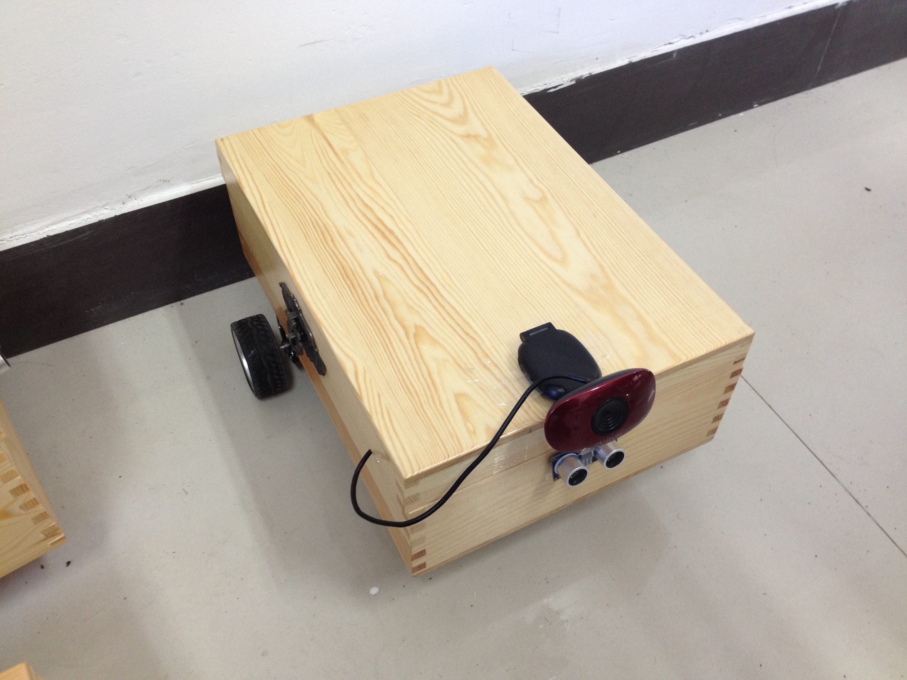
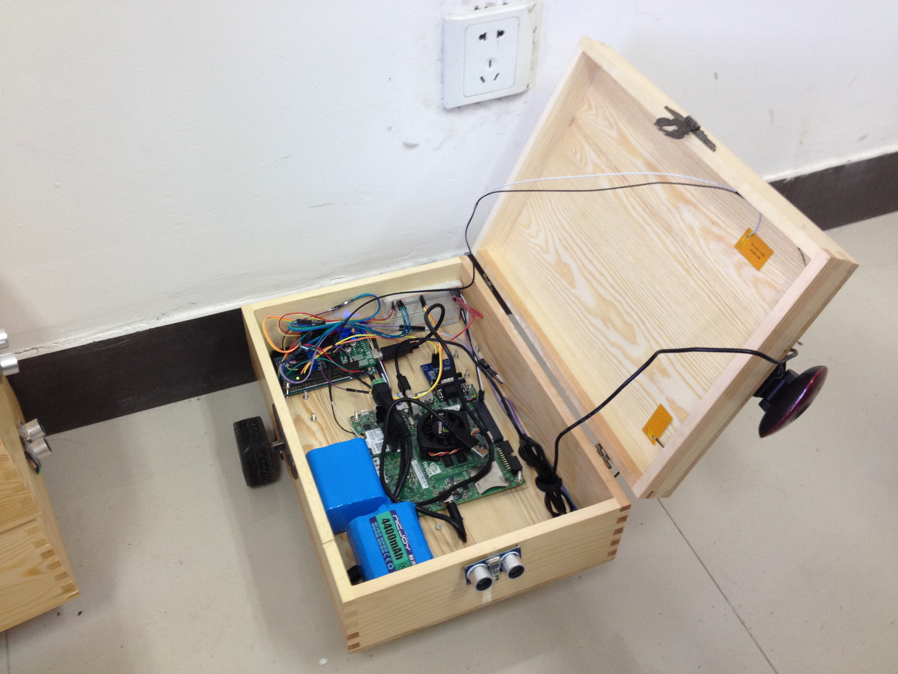

# woodbox_mobile_car





## Description

### Arduino
- **woodbox_mobile_car_serial_control:**
Control the car move by using serial port.

- **woodbox_mobile_car_obstacle_avoidance:**
Make the car avoid obstacles by using ultrasonic sensor.

- **woodbox_mobile_car_follow_people:**
Make the car follow people by using face recognition from jetson tk1.

### Jetson TK1
- **face_capture:**
Capture some face's pictures from camera, convert them to gray images and resize them to default size.

- **face_detection:**
Detect faces by using opencv haar cascade classifier.

- **face_train:**
Before starting to recognize face, use some face's pictures to train for generating face's model file.

- **face_recognition:**
Load face's model file and receive specific faces to start face recognition.

## Configure
Use following command to get woodbox_mobile_car sources:

```bash
$> cd ~/Desktop
$> git clone https://www.github.com/myyerrol/woodbox_mobile_car.git
```

### Arduino

1. Move the **arduino/WoodboxMobileCar** floder to your **Arduino/libraries**. In linux, the default location of arduino libraries is **~/Arduino/libraries**, if you change it, please use new path to replace under!
```bash
$> cp -r woodbox_mobile_car/arduino/WoodboxMobileCar ~/Arduino/libraries
```

2. Open the arduino software, and you can find three demo files in the **File/Examples/WoodMobileCar** option. You can load any of these to test their function.

### Jeston TK1
- **face_capture:**
This part of codes use cmake build system. If you want to use IDE to edit or improve these codes, you can start qtcreator and open **CMakeLists.txt** file to load this project. Of course, you also can build them in the terminal directly by using following command.
```bash
$> cd woodbox_mobile_car/jetson_tk1/face_capture
$> mkdir build
$> cd build
$> cmake ..
$> make
$> ./face_capture
```

- **face_detection:**
This part of codes use cmake build system. If you want to use IDE to edit or improve these codes, you can start qtcreator and open **CMakeLists.txt** file to load this project. Of course, you also can build them in the terminal directly by using following command.
```bash
$> cd woodbox_mobile_car/jetson_tk1/face_detection
$> mkdir build
$> cd build
$> cmake ..
$> make
$> ./face_detection
```

- **face_recognition:**
Before building, please replace the global veriable `g_save_model_path` to your absolute path to `face_recognition_model.txt`.
```bash
$> cd woodbox_mobile_car/jetson_tk1/face_recognition
$> make all
$> ./face_train
$> ./face_recognition
```

## Summary
Though the time is limited, I still have learned some knowledges about how to use opencv to implement simple face detection and recognition in nvidia jetson tk1. I believe I can do better in the future!
